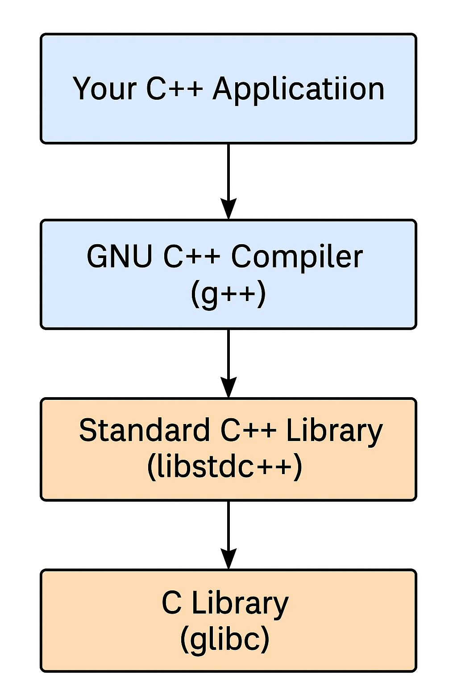

# Essential Concepts:

#### "3" cornerstones of system programming:
- **System Calls**
- **C Library**
- **C Compiler**

---

## System Calls

📘 **Linux System Calls vs Windows – Explanation**

🔹 **1. Linux has fewer system calls than Windows**

- Linux implements around **300 system calls** on the x86-64 architecture.
- In comparison, Windows is believed to have **thousands of system calls**.
- System calls are the interface between user-space programs and the kernel (used for operations like file I/O, memory management, process creation, etc.).

**Why Linux has fewer:**

- Linux prefers a minimal, clean system call interface.
- User-space libraries (e.g., glibc) often provide higher-level wrappers.
- Windows, being more complex and backward-compatible, includes many more system calls and subsystems.

🔹 **2. Linux supports multiple hardware architectures**

- Linux is portable and runs on many architectures:
  - **x86, x86-64**
  - **ARM, AArch64**
  - **PowerPC**
  - **RISC-V**
  - **Alpha, MIPS**, etc.

- Each architecture can define additional architecture-specific system calls if needed.

📌 **Example:** A syscall to manage special registers on PowerPC may not exist on x86.

🔹 **3. Most system calls are common across all architectures**

- Despite architecture-specific additions, over **90% of system calls** are shared across all supported architectures.

**This ensures:**

- Consistency in application development.
- Portability of user-space programs.
- Easier maintenance of cross-platform code.

🔄 **Analogy**

Think of Linux system calls as tools in a toolbox:

- Most toolboxes (architectures) share the same essential tools.
- Some toolboxes may include extra tools for special jobs (architecture-specific syscalls).
- But the majority of work can be done using the common set.

---

## 🔐 **User Space vs Kernel Space – System Call Mechanism**

### ❌ **Direct access from user space to kernel space is not allowed**

- User-space applications **cannot directly execute kernel code** or access kernel memory.

**Reasons:**

- **Security**: Prevent apps from taking control of the system.
- **Stability**: Avoid system crashes due to user app bugs.

---

### 🔁 **System Call Invocation Process**

1. A user application needs a service (e.g., open a file).
2. It uses a **special CPU instruction** to trigger a **system call**.
3. This instruction switches the CPU from **user mode to kernel mode**.
4. The kernel's **system call handler** performs the requested action.
5. The result is returned to the application.

---

### 🖥️ **Example: `int 0x80` on x86 (i386)**

- On 32-bit Intel (i386), system calls are invoked with:
  ```asm
  int 0x80
  ```

  A user-space application uses the `int 0x80` instruction.

  This is a software interrupt — it tells the CPU:

  - “Pause what you're doing and jump to the kernel’s interrupt handler for interrupt 0x80.”

  The handler for `int 0x80` is the Linux system call handler.

  - It reads the syscall number and arguments from CPU registers.
  - Executes the requested system call.
  - Returns control back to the application.

  🧠 **This mechanism is hardware-supported and ensures only allowed kernel code runs, even during a syscall.**


## 🧠 How Compiler and C Libraries Handle System Calls

### ✅ 1. C Library Provides Wrapper Functions

- Applications use C functions like `open()`, `read()`, `write()`.
- These are defined in C libraries such as `glibc`, `musl`, etc.
- The C library wraps the system call and uses architecture-specific code to invoke it.

---

### ✅ 2. Architecture-Specific Code in the C Library

- Each architecture uses different instructions:
  | Architecture | Syscall Instruction | Example |
  |--------------|---------------------|---------|
  | x86-32       | `int 0x80`          | `mov eax, SYS_read; int 0x80` |
  | x86-64       | `syscall`           | `mov rax, SYS_read; syscall`  |
  | ARM          | `svc #0`            | `mov r7, SYS_read; svc #0`    |
  | RISC-V       | `ecall`             | `li a7, SYS_read; ecall`      |

- These instructions are embedded in **assembly code** inside the C library.

---

### ✅ 3. Registers Used for Arguments (Linux ABI)

| Architecture | Syscall Number Register | Argument Registers        |
|--------------|--------------------------|----------------------------|
| x86-32       | `eax`                    | `ebx`, `ecx`, `edx`, etc. |
| x86-64       | `rax`                    | `rdi`, `rsi`, `rdx`, etc. |
| ARM          | `r7`                     | `r0`, `r1`, `r2`, etc.    |
| RISC-V       | `a7`                     | `a0`, `a1`, `a2`, etc.    |

---

### ✅ 4. Compiler Just Calls C Functions

- The compiler compiles calls to functions like `read()` into machine code.
- It links with the C library, which contains the system call implementation.
- The syscall logic is **not handled by the compiler directly**.

---

### ✅ 5. Low-Level Fallback: `syscall()` Function

- Provided by `unistd.h` and `sys/syscall.h`.
- Allows invoking any syscall by number:
  ```c
  syscall(SYS_write, fd, buf, count);

## C Library

### 🧠 The Role of libc and glibc in Linux

### 🔹 What is libc?
- A standard library that provides essential runtime support to Unix/Linux applications.
- Handles string manipulation, memory allocation, file I/O, process control, etc.

### 🔹 glibc = GNU C Library
- Most widely used implementation of `libc` on Linux systems.
- Pronounced "gee-lib-see".
- Maintained by the GNU Project.
  
### 🔹 glibc Provides:
| Component             | Description |
|----------------------|-------------|
| Standard C Library   | Implements `printf()`, `malloc()`, `strlen()`, etc. |
| System Call Wrappers | Functions like `open()`, `read()`, `write()` that invoke syscalls. |
| Threading Support    | POSIX Threads (`pthread_create()`, `mutexes`, etc.) |
| Application Facilities | Networking, locale, math, dynamic loading, time, etc. |

### 🔹 Used by All Languages
- Languages like Python, Java, and Rust indirectly rely on glibc via their runtime or native bindings.

## 🧱 C++ System Programming on Linux
C++ adds two more corestones to the existing 3 of it mentioned above



### 🔹 Cornerstone 1: Standard C++ Library (`libstdc++`)
- Implements the ISO C++ standard (e.g., C++11).
- Provides:
  - STL containers (`std::vector`, `std::map`)
  - Streams (`std::cout`, `std::cin`)
  - Algorithms (`std::sort`, etc.)
  - Threading (`std::thread`, `std::mutex`)
  - Smart pointers and more.
- Internally relies on `libc` and syscalls for low-level operations.

---

### 🔹 Cornerstone 2: GNU C++ Compiler (`g++`)
- The standard C++ compiler on Linux.
- Used to compile `.cpp` files:
  ```bash
  g++ main.cpp -o output

